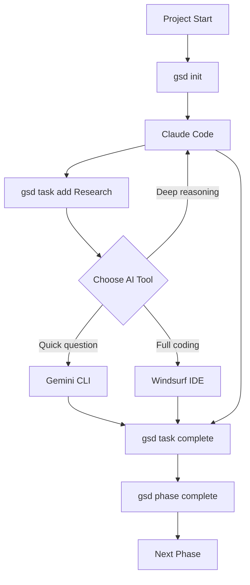

# AI Tools Research Summary 2026
## Claude Code CLI, Windsurf, Gemini CLI, and GSD

**Research Date:** February 19, 2026
**Status:** SOTA Tools Integration for CO-OP Curriculum

---

## Table of Contents

1. [Claude Code CLI](#1-claude-code-cli)
2. [Windsurf IDE (Codeium)](#2-windsurf-ide-codeium)
3. [Google Gemini CLI](#3-google-gemini-cli)
4. [Get Shit Done (GSD)](#4-get-shit-done-gsd)
5. [Integration Recommendations](#5-integration-recommendations)

---

## 1. Claude Code CLI

### Overview
Claude Code CLI is Anthropic's official command-line interface for interacting with Claude AI models. It provides terminal-based AI assistance for coding, debugging, and development workflows.

### Installation

```bash
# Official install script
curl -fsSL https://claude.ai/install.sh | bash

# Verify installation
claude --version
```

### Authentication

```bash
# Login to Claude
claude login

# This will open a browser for authentication
# API key stored in ~/.config/claude/config.json
```

### Configuration

Create `~/.claude/config.json`:

```json
{
  "api_key": "your-api-key-here",
  "model": "claude-3-5-sonnet-20241022",
  "max_tokens": 8192,
  "temperature": 0.3,
  "context_window": 200000
}
```

### MCP (Model Context Protocol) Servers

MCP is an open standard for connecting AI applications to external systems.

#### Installing MCP Servers

```bash
# Navigate to Claude config directory
cd ~/.claude

# Edit MCP servers configuration
nano mcp_servers.json
```

#### Example MCP Configuration

```json
{
  "mcpServers": {
    "filesystem": {
      "command": "npx",
      "args": ["-y", "@anthropic/mcp-server-filesystem", "/path/to/allowed/files"]
    },
    "github": {
      "command": "npx",
      "args": ["-y", "@anthropic/mcp-server-github"]
    },
    "postgres": {
      "command": "npx",
      "args": ["-y", "@anthropic/mcp-server-postgres", "postgresql://..."]
    }
  }
}
```

#### Available MCP Servers

| Server | Purpose | Install Command |
|--------|---------|-----------------|
| `@anthropic/mcp-server-filesystem` | File system access | `npx -y @anthropic/mcp-server-filesystem /path` |
| `@anthropic/mcp-server-github` | GitHub integration | `npx -y @anthropic/mcp-server-github` |
| `@anthropic/mcp-server-postgres` | PostgreSQL queries | `npx -y @anthropic/mcp-server-postgres` |
| `@anthropic/mcp-server-brave-search` | Web search | `npx -y @anthropic/mcp-server-brave-search` |
| `@anthropic/mcp-server-fetch` | HTTP requests | `npx -y @anthropic/mcp-server-fetch` |

### Custom Skills

Skills are reusable instruction packages for Claude Code.

#### Creating a Custom Skill

```bash
# Create skills directory
mkdir -p ~/.claude/skills

# Create a skill file
cat > ~/.claude/skills/react-component.md << 'EOF'
# React Component Generator

You are a React component specialist. When asked to create components:

1. Use TypeScript with strict typing
2. Implement proper props interfaces
3. Add accessibility attributes
4. Include error boundaries
5. Use Tailwind CSS for styling
6. Follow React best practices (hooks, composition)
7. Include JSDoc comments
8. Add PropTypes for runtime validation

Output format:
- Single file with all imports
- Clear component name
- Props interface documented
- Usage example in comments
EOF
```

#### Using Skills

```bash
# Use a skill in conversation
claude "Using my react-component skill, create aLoginForm component"

# List available skills
claude skills list

# Load specific skill
claude skills load react-component
```

### API Usage

```bash
# Set API key
export ANTHROPIC_API_KEY="your-api-key"

# Use Claude via API
curl https://api.anthropic.com/v1/messages \
  -H "x-api-key: $ANTHROPIC_API_KEY" \
  -H "anthropic-version: 2023-06-01" \
  -H "content-type: application/json" \
  -d '{
    "model": "claude-3-5-sonnet-20241022",
    "max_tokens": 1024,
    "messages": [{"role": "user", "content": "Hello, Claude!"}]
  }'
```

### Common Commands

```bash
# Interactive chat
claude

# Ask a question
claude "Explain async/await in JavaScript"

# Generate code
claude "Create a REST API with Express.js"

# Debug code
claude debug ./src/app.js

# Review code
claude review ./src/

# Generate tests
claude test ./src/utils.js
```

### Integration Examples

#### With Git Hooks

```bash
# Create pre-commit hook
cat > .git/hooks/pre-commit << 'EOF'
#!/bin/bash
# Run Claude code review on staged files
claude review $(git diff --cached --name-only)
EOF

chmod +x .git/hooks/pre-commit
```

#### With CI/CD

```yaml
# .github/workflows/claude-review.yml
name: Claude Code Review
on: [pull_request]
jobs:
  review:
    runs-on: ubuntu-latest
    steps:
      - uses: actions/checkout@v4
      - name: Run Claude review
        run: |
          claude review ./src
        env:
          ANTHROPIC_API_KEY: ${{ secrets.ANTHROPIC_API_KEY }}
```

---

## 2. Windsurf IDE (Codeium)

### Overview
Windsurf is Codeium's AI-native IDE built on the open-source VS Code framework. It features the Cascade agent for deep code understanding and multi-file editing.

### Installation

#### Download and Install

```bash
# Visit https://www.codeium.com/windsurf
# Download for your platform (macOS, Linux, Windows)

# macOS (via Homebrew)
brew install --cask windsurf

# Linux (deb)
sudo dpkg -i windsurf_*.deb

# Linux (AppImage)
chmod +x Windsurf-*.AppImage
./Windsurf-*.AppImage
```

#### First Launch

1. Open Windsurf
2. Sign in with Google, GitHub, or email
3. Complete the welcome tour
4. Configure workspace settings

### Key Features

#### Cascade Agent

Cascade is Windsurf's flagship AI agent for deep code understanding:

- **Multi-file context**: Understands relationships across files
- **Refactoring**: Smart code restructuring across projects
- **Bug fixing**: Identifies and fixes issues with context
- **Code generation**: Creates consistent code with project patterns
- **Documentation**: Generates docs based on codebase analysis

#### AI Features

| Feature | Description |
|---------|-------------|
| **Autocomplete** | Context-aware code suggestions |
| **Inline Chat** | Ask questions without leaving editor |
| **Command Palette** | Quick actions via Ctrl/Cmd+Shift+A |
| **Refactor** | AI-powered code refactoring |
| **Explain** | Get explanations for selected code |
| **Fix** | Auto-fix errors and warnings |
| **Test Generation** | Generate unit tests |
| **Doc Generation** | Generate JSDoc/comments |

### Configuration

#### Settings

Open settings with `Ctrl/Cmd+,`:

```json
{
  "codeium.enableCode autocomplete": true,
  "codeium.enableInlineChat": true,
  "codeium.explain.codeLens": true,
  "codeium.inlineChat.triggerKey": "ctrl+shift+a",
  "windsurf.cascade.enabled": true,
  "windsurf.cascade.contextFiles": 50,
  "editor.formatOnSave": true,
  "editor.tabSize": 2
}
```

#### Keybindings

| Action | Windows/Linux | macOS |
|--------|---------------|-------|
| Inline Chat | `Ctrl+Shift+A` | `Cmd+Shift+A` |
| Autocomplete | `Tab` | `Tab` |
| Explain Code | `Ctrl+Shift+E` | `Cmd+Shift+E` |
| Fix Code | `Ctrl+Shift+R` | `Cmd+Shift+R` |
| Cascade Agent | `Ctrl+Shift+X` | `Cmd+Shift+X` |

### Setup for Development

#### Project Setup

```bash
# Create new project
mkdir my-project && cd my-project
npm init -y

# Open in Windsurf
windsurf .

# Or use code command
code .
```

#### Workspace Configuration

Create `.vscode/settings.json`:

```json
{
  "typescript.tsdk": "node_modules/typescript/lib",
  "typescript.enablePromptUseWorkspaceTsdk": true,
  "editor.formatOnSave": true,
  "editor.defaultFormatter": "esbenp.prettier-vscode",
  "editor.codeActionsOnSave": {
    "source.fixAll.eslint": "explicit"
  },
  "codeium.enableCode autocomplete": true,
  "windsurf.cascade.enabled": true
}
```

### Cascade Agent Usage

#### Multi-file Editing

1. Select files in explorer (Ctrl/Cmd+Click)
2. Right-click → "Cascade: Edit selected files"
3. Describe changes in natural language
4. Review and apply changes

#### Refactoring

```bash
# Example refactoring request
# Select code and use Cascade:

"Refactor this component to:
1. Extract validation logic to a custom hook
2. Add TypeScript interfaces for props
3. Implement error boundaries
4. Add loading states
5. Improve accessibility"
```

#### Codebase Understanding

```
Cascade: Analyze this codebase and provide:
1. Project architecture overview
2. Key dependencies and their purposes
3. Potential security vulnerabilities
4. Performance optimization opportunities
5. Technical debt assessment
```

### Integration with Tools

#### Git Integration

- Inline diff viewing
- Commit message generation
- PR description generation
- Code review assistance

#### Terminal Integration

```bash
# Windsurf includes integrated terminal
# Use it for:
npm run dev
git add .
npm test
```

#### Extension Ecosystem

Windsurf supports VS Code extensions:

```bash
# Popular extensions for Windsurf
- ESLint
- Prettier
- GitLens
- Thunder Client (API testing)
- Live Server
- Docker
```

---

## 3. Google Gemini CLI

### Overview
Google Gemini CLI provides command-line access to Google's Gemini AI models, including the latest Gemini 2.5 Pro with 1M token context window.

### Installation

```bash
# Via npm
npm install -g @google/gemini-cli

# Verify installation
gemini --version

# Or via cargo (if available)
cargo install google-gemini-cli
```

### Authentication

```bash
# Method 1: API Key
export GEMINI_API_KEY="your-api-key"

# Get API key from: https://makersuite.google.com/app/apikey

# Method 2: Service Account (for production)
export GOOGLE_APPLICATION_CREDENTIALS="/path/to/service-account.json"

# Method 3: OAuth 2.0
gemini auth login
```

### Configuration

Create `~/.gemini/config.json`:

```json
{
  "model": "gemini-2.5-pro-preview-03-25",
  "temperature": 0.3,
  "maxTokens": 8192,
  "topP": 0.95,
  "topK": 40,
  "safetySettings": [
    {
      "category": "HARM_CATEGORY_HARASSMENT",
      "threshold": "BLOCK_MEDIUM_AND_ABOVE"
    }
  ]
}
```

### Available Models

| Model | Context | Description |
|-------|---------|-------------|
| `gemini-2.5-pro` | 1M tokens | Latest, most capable |
| `gemini-2.0-flash` | 1M tokens | Fast, for simple tasks |
| `gemini-1.5-pro` | 2M tokens | Large context |
| `gemini-1.5-flash` | 1M tokens | Fast, efficient |

### Usage Examples

#### Basic Usage

```bash
# Interactive mode
gemini chat

# Ask a question
gemini ask "Explain React hooks"

# Generate code
gemini code "Create a REST API with Express.js" > server.js

# Explain code
gemini explain server.js

# Review code
gemini review ./src/
```

#### Advanced Usage

```bash
# With specific model
gemini --model gemini-2.5-pro "Analyze this codebase"

# With context file
gemini --context context.md "Generate tests for this module"

# Stream output
gemini --stream "Write a blog post about microservices"

# Save output
gemini "Create a README" > README.md
```

### Custom Skills and Agents

#### Creating a Skill

```bash
# Create skill directory
mkdir -p ~/.gemini/skills

# Create skill file
cat > ~/.gemini/skills/frontend-dev.md << 'EOF'
# Frontend Development Specialist

You are a senior frontend developer specializing in modern web technologies.

Core competencies:
- React 18+ with hooks and concurrent features
- TypeScript strict mode
- Tailwind CSS for styling
- Next.js 14+ for SSR/SSG
- Vite for tooling

Best practices to follow:
1. Component composition over prop drilling
2. Custom hooks for shared logic
3. Error boundaries for resilience
4. Accessibility first (WCAG 2.1 AA)
5. Performance optimization (lazy loading, code splitting)
6. SEO optimization (meta tags, structured data)

Always provide:
- Complete, runnable code
- TypeScript types
- Inline comments for complex logic
- Usage examples
EOF
```

#### Creating an Agent

```bash
# Agent configuration
cat > ~/.gemini/agents/review-agent.json << 'EOF'
{
  "name": "code-reviewer",
  "description": "Reviews code for best practices and potential issues",
  "instructions": "Review the provided code and identify:\n1. Security vulnerabilities\n2. Performance issues\n3. Code quality concerns\n4. Suggestions for improvement",
  "tools": ["read", "search"],
  "temperature": 0.2
}
EOF
```

#### Using Skills/Agents

```bash
# Use a skill
gemini --skill frontend-dev "Create a navigation component"

# Use an agent
gemini --agent code-reviewer --file ./src/app.js

# List skills
gemini skills list

# List agents
gemini agents list
```

### API Keys Setup

```bash
# Get API key from Google AI Studio
# 1. Visit https://makersuite.google.com/app/apikey
# 2. Create new API key
# 3. Copy the key

# Set environment variable
export GEMINI_API_KEY="your-api-key-here"

# Add to shell profile
echo 'export GEMINI_API_KEY="your-api-key"' >> ~/.bashrc
source ~/.bashrc
```

### Integration with Projects

#### Package.json Scripts

```json
{
  "scripts": {
    "ai:generate": "gemini code",
    "ai:review": "gemini review src/",
    "ai:test": "gemini test",
    "ai:explain": "gemini explain",
    "ai:docs": "gemini --skill documentation"
  }
}
```

#### Git Integration

```bash
# Add pre-commit hook for AI review
cat > .git/hooks/pre-commit << 'EOF'
#!/bin/bash
echo "Running AI code review..."
gemini review $(git diff --cached --name-only --diff-filter=ACM)
EOF

chmod +x .git/hooks/pre-commit
```

---

## 4. Get Shit Done (GSD)

### Overview
GSD (Get Shit Done) is a meta-prompting and context engineering system for AI coding assistants. It provides structured workflows, phase-based project management, and automated context gathering.

**Note:** GSD is NOT a browser extension. It is a command-line tool and development workflow system.

### Installation

```bash
# Npx (one-time use)
npx get-shit-done-cc@latest

# Global install for Claude Code
npx get-shit-done-cc --claude --global

# Via npm
npm install -g get-shit-done-cc

# Verify installation
gsd --version
```

### Configuration

GSD uses a project-based configuration system:

```bash
# Initialize GSD in project
cd my-project
gsd init

# Creates:
# .gsd/
#   config.json
#   phases/
#   context/
```

#### Configuration File

`.gsd/config.json`:

```json
{
  "project": {
    "name": "My Project",
    "description": "Project description",
    "version": "1.0.0"
  },
  "workflow": {
    "phases": [
      "planning",
      "development",
      "testing",
      "deployment"
    ],
    "currentPhase": "planning"
  },
  "ai": {
    "provider": "claude",
    "model": "claude-3-5-sonnet",
    "temperature": 0.3
  },
  "context": {
    "maxTokens": 100000,
    "includePatterns": [
      "src/**/*.ts",
      "src/**/*.tsx",
      "package.json",
      "README.md"
    ],
    "excludePatterns": [
      "node_modules/**",
      "dist/**",
      ".git/**"
    ]
  }
}
```

### Usage for Task Management

#### Phase-Based Workflow

```bash
# Add a phase
gsd phase add "Implement user authentication"

# List phases
gsd phase list

# Start a phase
gsd phase start "Implement user authentication"

# Complete a phase
gsd phase complete "Implement user authentication"

# View current phase status
gsd status
```

#### Task Management

```bash
# Add task to current phase
gsd task add "Create login form"

# List tasks
gsd task list

# Mark task complete
gsd task complete "Create login form"

# Add urgent work (decimal phase)
gsd phase insert "Fix critical bug" --after 7 --priority urgent
```

#### Context Management

```bash
# Gather context for AI
gsd context gather

# Update context
gsd context update

# View context summary
gsd context summary

# Add custom context
gsd context add "The API uses JWT tokens for authentication"
```

### Features

#### 1. Meta-Prompting

GSD automatically generates optimized prompts for AI assistants:

```bash
# Generate prompt for current task
gsd prompt generate

# This creates a structured prompt including:
# - Project context
# - Current phase goals
# - Relevant files
# - Technical constraints
# - Success criteria
```

#### 2. Context Engineering

```bash
# Map codebase for context
gsd codebase map

# This analyzes:
# - Project structure
# - Dependencies
# - Key files
# - Patterns used
# - Entry points
```

#### 3. Milestone Tracking

```bash
# Create milestone
gsd milestone create "MVP Release"

# Add phases to milestone
gsd milestone add-phase "User Auth" --to "MVP Release"
gsd milestone add-phase "Database" --to "MVP Release"

# Check milestone progress
gsd milestone progress "MVP Release"

# Complete milestone
gsd milestone complete "MVP Release"
```

#### 4. Work Session Management

```bash
# Start work session
gsd work start

# Pause with handoff notes
gsd work pause "Added user auth, need to test refresh token flow"

# Resume work
gsd work resume

# End session with summary
gsd work end
```

### Integration with AI Tools

#### Claude Code Integration

```bash
# GSD works seamlessly with Claude Code
# Use GSD prompts in Claude:

claude "$(gsd prompt generate)"

# Or pipe context
gsd context gather | claude "Review this context and suggest improvements"
```

#### Gemini CLI Integration

```bash
# Generate prompt for Gemini
gsd prompt generate | gemini code -

# Review code with GSD context
gemini review $(gsd context files)
```

### Workflow Example

```bash
# 1. Initialize project
mkdir my-app && cd my-app
npm init -y
gsd init

# 2. Plan phases
gsd phase add "Setup project structure"
gsd phase add "Implement authentication"
gsd phase add "Build dashboard"
gsd phase add "Add analytics"
gsd phase add "Deploy to production"

# 3. Start first phase
gsd phase start "Setup project structure"

# 4. Add tasks
gsd task add "Initialize Git repository"
gsd task add "Setup ESLint and Prettier"
gsd task add "Create base folder structure"

# 5. Generate AI prompt for work
claude "$(gsd prompt generate)"

# 6. Complete tasks
gsd task complete "Initialize Git repository"

# 7. Complete phase
gsd phase complete "Setup project structure"

# 8. Move to next phase
gsd phase start "Implement authentication"
```

### Available Commands

| Command | Description |
|---------|-------------|
| `gsd init` | Initialize GSD in project |
| `gsd status` | Show current status |
| `gsd phase add` | Add new phase |
| `gsd phase start` | Start working on phase |
| `gsd phase complete` | Mark phase complete |
| `gsd task add` | Add task to current phase |
| `gsd task complete` | Complete task |
| `gsd context gather` | Gather project context |
| `gsd prompt generate` | Generate AI prompt |
| `gsd work start` | Start work session |
| `gsd work pause` | Pause with notes |
| `gsd work resume` | Resume work session |

---

## 5. Integration Recommendations

### Curriculum Integration Plan

#### Week 1: Foundation (Day 4-5)

**Current:** Antigravity IDE (Gemini CLI), Cursor, Windsurf, Roo Code

**Add:**
- Claude Code CLI installation and configuration
- MCP servers setup
- Custom skills creation
- GSD initialization for projects

#### Daily Schedule Updates

```markdown
### Day 4: AI CLI Tools (Updated)

#### Morning Session (09:00-12:00)

##### 4.1 Claude Code CLI Setup

```bash
# Install Claude Code CLI
curl -fsSL https://claude.ai/install.sh | bash
claude login

# Configure MCP servers
mkdir -p ~/.claude
cat > ~/.claude/mcp_servers.json << 'EOF'
{
  "mcpServers": {
    "filesystem": {
      "command": "npx",
      "args": ["-y", "@anthropic/mcp-server-filesystem", "."]
    },
    "github": {
      "command": "npx",
      "args": ["-y", "@anthropic/mcp-server-github"]
    }
  }
}
EOF

# Verify setup
claude "List available MCP tools"
```

##### 4.2 Custom Skills Creation

```bash
# Create a custom skill for React development
mkdir -p ~/.claude/skills
cat > ~/.claude/skills/react-2026.md << 'EOF'
# React 2026 Development Specialist

You are a React expert working with SOTA 2026 best practices:

## Tech Stack
- React 19+ with Server Components
- TypeScript 5.8+ strict mode
- Tailwind CSS 4
- Vite 6 for tooling
- React Query for data fetching

## Must-Haves
1. Server Components by default
2. Client Components only when needed
3. Proper 'use' directives for hooks
4. Accessibility attributes (ARIA)
5. SEO meta tags
6. Error boundaries
7. Loading states
8. Proper TypeScript typing

## Output Format
- Single file when possible
- All imports at top
- Clear component naming
- Props interface documented
- Usage example in comments
EOF

# Use the skill
claude "Using react-2026 skill, create a LoginForm component"
```

##### 4.3 GSD Workflow Setup

```bash
# Install GSD
npx get-shit-done-cc@latest --global

# Initialize in project
cd ~/projects/my-app
gsd init

# Add phases
gsd phase add "Project setup"
gsd phase add "Feature development"
gsd phase add "Testing"
gsd phase add "Deployment"

# Add tasks
gsd task add "Initialize repository"
gsd task add "Setup ESLint"
gsd task add "Create base components"
```

#### Afternoon Lab (13:00-17:00)

##### Lab 4: AI-Powered Development Workflow

**Exercise:** Build a feature using Claude Code CLI + GSD

```bash
# 1. Start work session
gsd work start

# 2. Gather context
gsd context gather

# 3. Generate optimized prompt
PROMPT=$(gsd prompt generate)

# 4. Use Claude with the prompt
claude "$PROMPT" > implementation.md

# 5. Review and implement
# Read implementation.md and apply changes

# 6. Mark progress
gsd task complete "Create base components"

# 7. Pause with notes
gsd work pause "Implemented base components, ready for testing"
```

**Deliverable:** Working feature built with AI assistance
```

### Tools Comparison Table

| Feature | Claude Code | Windsurf | Gemini CLI | GSD |
|---------|-------------|----------|------------|-----|
| **Primary Use** | CLI AI assistant | Full IDE | CLI AI assistant | Workflow management |
| **Strength** | Deep reasoning, long context | IDE integration, Cascade | Fast responses, large context | Project organization |
| **Best For** | Terminal workflows | Full-day coding | Quick questions | Large projects |
| **MCP Support** | Native | Partial | No | N/A |
| **Custom Skills** | Yes | Via Cascade | Yes | Via prompts |
| **Cost** | API-based | Free tier available | API-based | Free |
| **Context Window** | 200K tokens | Unlimited (project) | 1M-2M tokens | Configurable |

### Recommended Workflow



### Assessment Updates

Add to Week 1 Assessment:

```markdown
### AI Tool Proficiency (New)

**Claude Code CLI (10 points)**
- [ ] Installation and authentication (2)
- [ ] MCP server configuration (3)
- [ ] Custom skill creation (3)
- [ ] API integration (2)

**Windsurf IDE (10 points)**
- [ ] Installation and setup (2)
- [ ] Cascade agent usage (4)
- [ ] Multi-file editing (2)
- [ ] Integration with Git (2)

**Gemini CLI (5 points)**
- [ ] Installation and API key (2)
- [ ] Basic commands (2)
- [ ] Custom skills (1)

**GSD Workflow (5 points)**
- [ ] Project initialization (2)
- [ ] Phase management (2)
- [ ] Task tracking (1)
```

---

## Appendix: Quick Reference

### Claude Code CLI Quick Reference

```bash
# Install
curl -fsSL https://claude.ai/install.sh | bash

# Login
claude login

# Interactive
claude

# One-shot
claude "your prompt"

# Review code
claude review ./src

# Debug
claude debug ./src/app.js
```

### Windsurf Quick Reference

```bash
# Install (macOS)
brew install --cask windsurf

# Open project
windsurf .

# Cascade agent
Ctrl+Shift+X (Windows/Linux)
Cmd+Shift+X (macOS)

# Inline chat
Ctrl+Shift+A (Windows/Linux)
Cmd+Shift+A (macOS)
```

### Gemini CLI Quick Reference

```bash
# Install
npm install -g @google/gemini-cli

# Set API key
export GEMINI_API_KEY="your-key"

# Interactive
gemini chat

# One-shot
gemini "your prompt"

# With skill
gemini --skill react-dev "create component"
```

### GSD Quick Reference

```bash
# Install
npx get-shit-done-cc@latest --global

# Initialize
gsd init

# Add phase
gsd phase add "Phase name"

# Add task
gsd task add "Task description"

# Generate prompt
gsd prompt generate

# Work session
gsd work start
# ... work ...
gsd work pause "notes"
```

---

**Document Version:** 1.0
**Last Updated:** February 19, 2026
**Next Review:** March 2026
